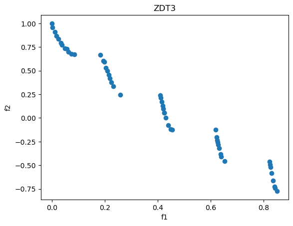

# NSGA-II Generator

This section contains documentation for `NSGA2Generator`, an implementation of the multiobjective optimization algorithm NSGA-II [1].
Consistent with Xopt's architecture, candidate solutions may be requested even after one-generation's-worth has been produced.
A single generation is considered finished once `population_size` evaluated individuals have been returned to the generator.
At that point, selection will occur, output will be generated (if `output_dir` has been set), and further generated children will use the latest population.
To strictly follow the NSGA-II algorithm, users should take care to only generate and evaluate exactly `population_size` individuals in a single batch to avoid the problem of

## Usage
For information on using `NSGA2Generator`, please choose from one of the following examples.

 - [YAML Interface](yaml_interface/index.md) - Using the generator from YAML config files (if new, start here).
 - [Python Interface](nsga2_python.ipynb) - Using the generator from its python API.
 - [Output Conversion](nsga2_to_cnsga.ipynb) - Using this generator's output with analysis scripts written for `CNSGAGenerator`.

## Genetic Operators
Genetic operators are implemented as pydantic objects allowing for their specification in YAML files and their serialization to save optimizer state.
The following are currently implemented.

 - `PolynomialMutation` - Mutation with polynomial probability distribution. Discussed in [2].
 - `SimulatedBinaryCrossover` - Crossover operator for real-coded genetic algorithms, described in [3].

## Benchmarking

Statistical benchmark tests were performed on `NSGA2Generator`, `CNSGAGenerator`, and a reference implementation of NSGA-II to compare performance.
These tests were performed using the test problems and analysis tools in the library [ParetoBench](https://github.com/electronsandstuff/ParetoBench).
A writeup of the results may be found below.

[Download Benchmarking Report](assets/benchmarking.pdf)

## References
 - [1] Deb, K., Pratap, A., Agarwal, S., & Meyarivan, T. A. M. T. (2002). A fast and elitist multiobjective genetic algorithm: NSGA-II. IEEE transactions on evolutionary computation, 6(2), 182-197.
 - [2] Deb, K. (2001). Multi-objective optimization using evolutionary algorithms. John Wiley & Sons.
 - [3] Deb, K. (1995). Simulated Binary Crossover for Continuous Search Space. Complex Systems, 34.
